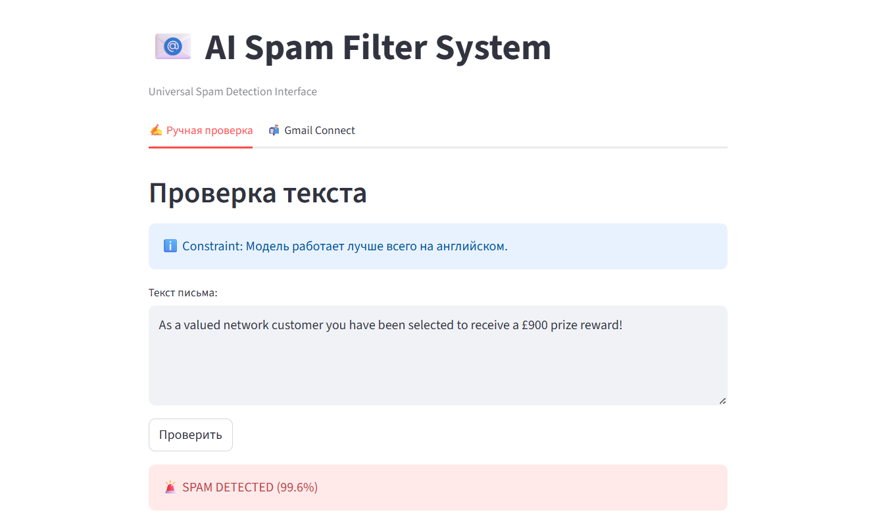
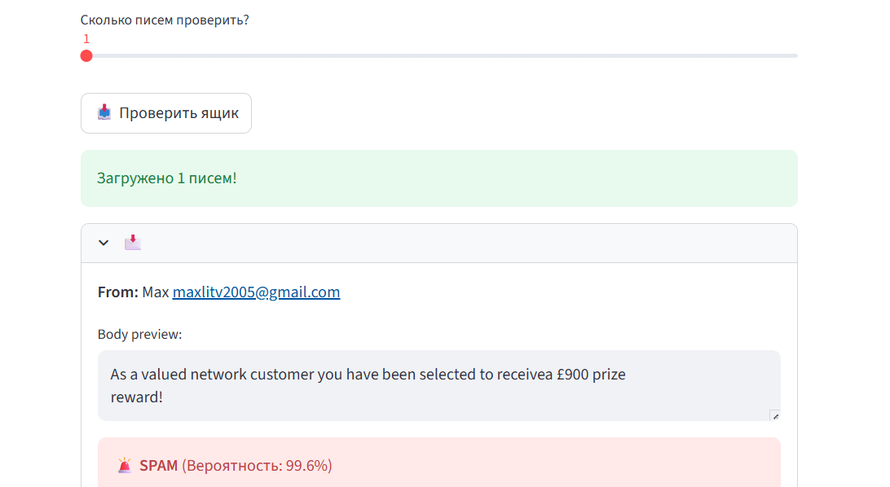

# 📧 AI Spam Filter

[](https://www.python.org/)
[](https://pytorch.org/)
[](https://huggingface.co/)
[](https://streamlit.io/)

> A production-ready Machine Learning application that detects spam emails using Transfer Learning with DistilBERT. Capable of real-time manual analysis and automated Gmail inbox filtering.

---

## 🚀 Overview

This project demonstrates an end-to-end NLP pipeline: from fine-tuning a Transformer model to deploying a user-friendly web interface. Unlike traditional rule-based filters, this solution uses **Deep Learning** to understand the semantic context of messages, identifying spam even without obvious keywords.

**Key Features:**
* **Real-time Inference:** Instant classification of text input.
* **Gmail Integration:** Connects securely via IMAP to analyze your actual inbox.
* **Confidence Scoring:** Provides probability metrics for every prediction.
* **Efficient Architecture:** Uses DistilBERT for a 40% reduction in size and 60% increase in speed compared to BERT-base.

---

## 🏗 Architecture

The system is built on the **Fine-Tuning** paradigm. We leverage the knowledge of a pre-trained Large Language Model and adapt it to the specific task of Spam Detection.

### 1. The Model (Brain)
* **Base:** `distilbert-base-uncased` (Pre-trained on English Wikipedia and BookCorpus).
* **Fine-tuning:** Trained on the [UCI SMS Spam Collection Dataset](https://archive.ics.uci.edu/ml/datasets/sms+spam+collection).
* **Tokenizer:** WordPiece tokenization with a vocabulary size of ~30,000.
* **Mechanism:** The model produces a 768-dimensional vector for the `[CLS]` token, which is then fed into a binary classification head (Logistic Regression layer).

### 2. The Tech Stack
* **Training:** Google Colab (T4 GPU) using `HuggingFace Trainer API`.
* **Inference:** Local CPU execution (PyTorch).
* **Frontend:** Streamlit for rapid UI prototyping.
* **Backend:** Python `imaplib` for secure email fetching.

---

## 📸 Demo

### 1. Manual Text Analysis
*Test suspicious messages instantly via the web interface.*



### 2. Gmail Inbox Integration
*Securely fetch and analyze recent emails from your real inbox.*



---

## 🛠 Installation & Usage

### Prerequisites
* Python 3.8+
* Git

### Step 1: Clone the Repository
```bash
git clone [https://github.com/YOUR_USERNAME/ai-spam-filter.git](https://github.com/YOUR_USERNAME/ai-spam-filter.git)
cd ai-spam-filter
```

### Step 2: Set up the Environment
```bash
# Create virtual environment
python -m venv .venv
source .venv/bin/activate # On Windows: .venv\Scripts\activate

# Install dependencies
pip install -r requirements.txt
```

### Step 3: Get the Model

Due to GitHub file size limits, the fine-tuned model weights are not included in this repo. You have two options:

1.  **Train it yourself:** Open `train_spam_model.py` in Google Colab (GPU recommended) and run the script. [cite_start]It will generate a `my_spam_model` folder[cite: 41, 42, 43].
2.  [cite_start]**Move the folder:** Place the `my_spam_model` folder into the root directory of this project[cite: 44].

### Step 4: Run the App

```bash
streamlit run app.py
```

The application will open in your browser at `http://localhost:8501`.

---

## 🔐 Security Note regarding Gmail

To use the Gmail integration feature securely:

1.  Enable **2-Step Verification** in your Google Account.
2.  Generate an **App Password** (Search for "App passwords" in settings).
3.  Use this **16-character code** instead of your regular password.

> **Privacy Warning:** Your credentials are **NOT** stored. They are used only in the active session RAM for real-time authentication.

## 📈 Future Improvements

We are actively working on scaling the solution:

- [ ] **Multilingual Support:** Retrain on `xlm-roberta` to support Russian.
- [ ] **Dockerization:** Wrap the application in a Docker container for easier deployment.
- [ ] **User Feedback Loop:** Allow users to correct the model ("Report as Spam") to improve accuracy.
